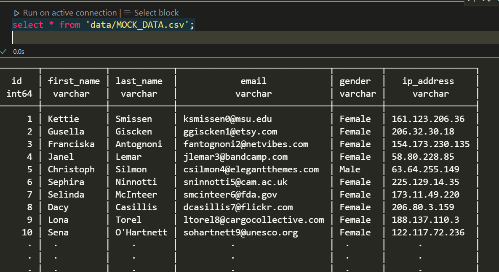

<p align="center">
  <a href="https://ducklake.io/ducklab" rel="noopener">
 </a>
</p>

<!-- <h3 align="center">ducklab</h3> -->

<div align="center">

[]()
[](https://ducklake.io)
[](https://github.com/ducklake-hq/ducklab/issues)
[](/LICENSE)

</div>

---

<p align="center"> Interactive SQL and PySpark Notebooks | Powered by DuckDB
    <br> 
</p>

## 📝 Table of Contents

- [📝 Table of Contents](#-table-of-contents)
- [🧐 About ](#-about-)
- [🔥 Features ](#-features-)
- [🏁 Getting Started ](#-getting-started-)
  - [Using Ducklab SQL Kernel (no dependencies required)](#using-ducklab-sql-kernel-no-dependencies-required)
  - [Using Ducklab Python Kernel](#using-ducklab-python-kernel)
  - [Using Ducklab Spark Kernel](#using-ducklab-spark-kernel)
  - [Import Databricks Notebook](#import-databricks-notebook)
- [💬 Contribute](#-contribute)
  - [Implement a new feature](#implement-a-new-feature)
  - [Request a new feature](#request-a-new-feature)
  - [Fix a bug](#fix-a-bug)
- [🎉 Acknowledgements ](#-acknowledgements-)

## 🧐 About <a name = "about"></a>

DuckLab for VS Code provides data analysis features for SQL, PySpark and Python. It uses DuckDB to process your data locally.

## 🔥 Features <a name = "features"></a>

- Run SQL and Python in the same notebook using same duckdb instance (exposed as `db` variable in python)
- Ducklab Spark Kernel allows running pyspark code using `duckdb.experimental.spark` module (exposed as `spark`, a `SparkSession` instance).
- Import Databricks `.py` notebooks and preview in a user-friendly VS Code Notebook window.
- Use any python, venv or conda environment detected by VS Code Python extension.
- Git-friendly `.isql` format. This format is plain text and human readable. 
- Ducklab doesn't use `ipynb` format which stores cell outputs in the file and pollutes git. It also makes diff in pull requests unreadable.

## 🏁 Getting Started <a name = "getting_started"></a>

### Using Ducklab SQL Kernel (no dependencies required)

1. Create a new `.isql` file.
2. Select kernel `ducklab-sql`
3. Run SQL queries e.g. `select * from 'data/MOCK_DATA.csv';`



### Using Ducklab Python Kernel

1. Make sure python or Anaconda is installed.
2. Create a new `.isql` file.
3. Select kernel `ducklab-python`
4. Select Python environment from bottom-right corner
5. `ducklab-python` kernel will have `db` variable (duckdb connection) already initialized for you.
6. Run python or SQL code

### Using Ducklab Spark Kernel

1. Make sure python or Anaconda is installed.
2. Create a new `.isql` file.
3. Select kernel `ducklab-spark`
4. Select Python environment from bottom-right corner
5. `ducklab-spark` kernel will have `spark` variable (SparkSession) already initialized for you.
6. Run spark code,

```
import pandas as pd
from duckdb.experimental.spark.sql.functions import lit, col

pandas_df = pd.DataFrame({
    'age': [34, 45, 23, 56],
    'name': ['Joan', 'Peter', 'John', 'Bob']
})

df = spark.createDataFrame(pandas_df)
df = df.withColumn(
    'location', lit('Seattle')
)
df = df.select(
    col('age'),
    col('location')
)

display(df)
```

### Import Databricks Notebook

1. Right click on a Databricks `.py` notebook file
2. Click `Import Databricks Notebook`

## 💬 Contribute

Contributions are most welcome. There are various ways you can contribute,

### Implement a new feature
1. Create an issue and provide your reasoning on why you want to add this feature.
2. Discuss your approach and design.
3. Implement the feature and submit your PR.

### Request a new feature
1. Open an issue and provide details about your feature request.
2. In case other tools implement that functionality then it will be helpful to share the reference for inspiration and design.

### Fix a bug
1. If you are resolving an issue, please add fix: #<issue number> <short message> in your PR title (e.g.fix: #3899 update entities encoding/decoding).
2. Provide a short description of the bug in your PR and/or link to the issue.

## 🎉 Acknowledgements <a name = "acknowledgement"></a>

- [DuckDb](https://duckdb.org/) - In-process analytics database
